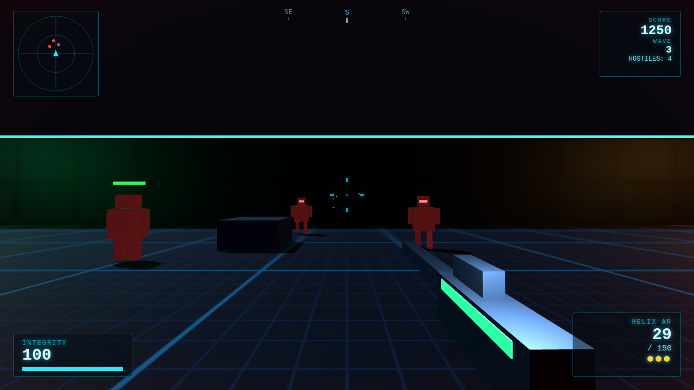

# NEON STRIKE — 3D Web FPS

A wave-survival 3D first-person shooter inspired by Call of Duty, with a
minimalist neon aesthetic, that runs entirely in the browser. No build step,
no external network requests — Three.js is vendored in `lib/`, all textures
are generated procedurally, and every sound effect is synthesized with
WebAudio at runtime.



## Play

ES modules require an HTTP server (opening `index.html` via `file://` won't work).
From the repo root, run any static server:

```sh
# Python
python3 -m http.server 8080

# ...or Node
npx serve .
```

Then open <http://localhost:8080> and click **ENGAGE**.

## Controls

| Input | Action |
| --- | --- |
| `W A S D` | Move |
| Mouse | Aim |
| Left click | Fire |
| Right click (hold) | Aim down sights |
| `G` | Throw frag grenade |
| `Shift` | Sprint |
| `Ctrl` (hold) / `C` (toggle) | Crouch |
| `Space` | Jump (crates are climbable) |
| `1`–`8` or wheel | Switch weapon |
| `R` | Reload |
| `Esc` | Pause (sensitivity & volume settings) |

## Core features

- **Aim down sights** — per-weapon zoom and accuracy, reduced mobility, a
  true scope overlay on the sniper.
- **Regenerating health** — survive a few seconds without damage and your
  integrity recovers, CoD-style. Health packs still drop for emergencies.
- **Sprint with sprint-out** — sprinting raises your weapon; you can't fire
  until you settle.
- **Crouch** — smaller profile, steadier aim, slower movement.
- **Killstreaks** — chain kills without taking damage: RAMPAGE (5),
  ONSLAUGHT (10), UNSTOPPABLE (15) and GODLIKE (20) pay score bonuses and
  ammo refills.
- **Full HUD** — rotating radar with threat types, compass strip, kill feed,
  hitmarkers (kill-confirm variant), directional damage indicators, dynamic
  crosshair that opens with movement and fire, low-health effects.
- **Frag grenades** — cooked physics: they arc, bounce, and detonate with
  falloff splash damage that also hurts you.

## Arsenal

| Slot | Weapon | Role |
| --- | --- | --- |
| 1 | **P-9 Sidearm** | Semi-auto pistol, infinite reserve |
| 2 | **Viper SMG** | 800 RPM hose, full mobility |
| 3 | **Helix AR** | Full-auto all-rounder |
| 4 | **Judge DMR** | Hard-hitting semi-auto marksman rifle |
| 5 | **Breacher** | 8-pellet pump shotgun |
| 6 | **Bastion LMG** | 75-round belt, slow reload, heavy |
| 7 | **Spectre** | Bolt sniper, scope zoom, one-shot potential |
| 8 | **Havoc RL** | Rocket launcher with splash damage |

Headshots deal double damage (2.5× on the Spectre).

## Enemies

- **Grunt** (red) — fast melee chaser.
- **Ranger** (blue) — keeps its distance and fires plasma bolts; uses
  line-of-sight, so cover works.
- **Tank** (purple) — slow, huge, and very angry. Appears from wave 4.

Waves grow larger and tougher; every fifth wave is flagged as a danger wave.
Destroyed enemies drop **health packs**, **ammo cells** (a magazine for every
weapon), or **grenade cells**. Score and best streak are tracked with a
persistent local best.

## Tech notes

- [Three.js](https://threejs.org/) r170, vendored as a single ES module in
  `lib/three.module.js` (MIT).
- Custom AABB "move and slide" physics for the player and enemies — walk into
  crates to be blocked, jump on top of them for a vantage point.
- Hitscan weapons raycast against enemy hitboxes (separate head hitbox for
  headshots) and world geometry, with pooled tracers and GPU point-sprite
  particles. Rockets and grenades are simulated projectiles with radial
  splash falloff.
- Enemy AI: seek/strafe steering with separation, stuck detection with
  sidestep recovery, and raycast line-of-sight checks for ranged attacks.
- Procedural canvas textures, DOM/CSS HUD with canvas radar + compass,
  WebAudio-synthesized SFX.

## Development

Plain ES modules — edit and refresh. `window.__game` exposes the game
instance in the console for debugging (e.g. `__game.godMode = true`).
