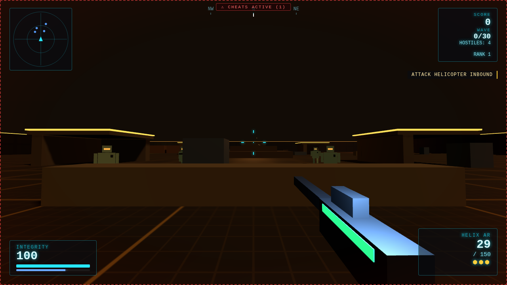
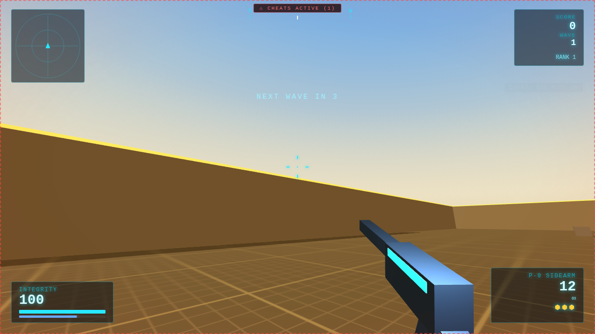
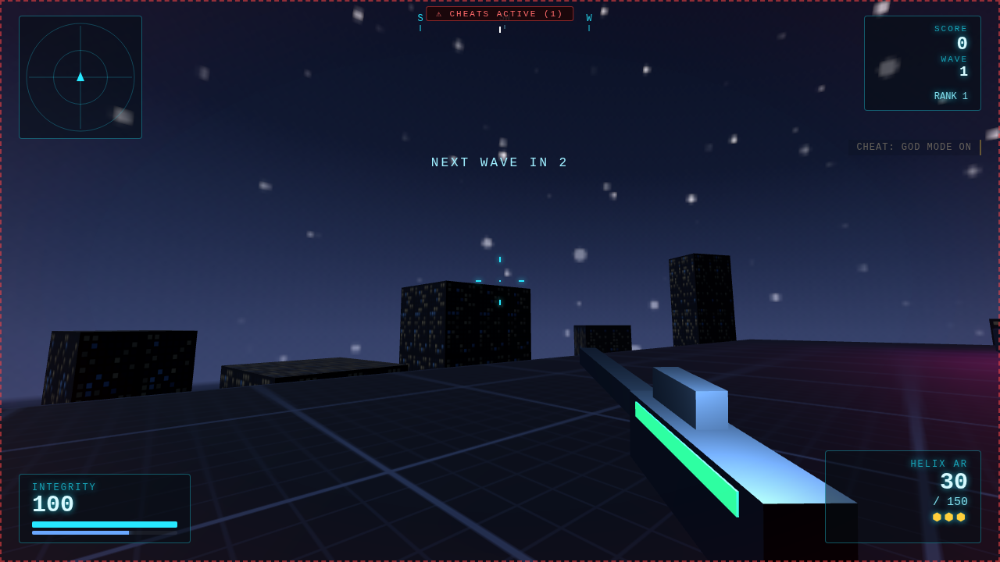
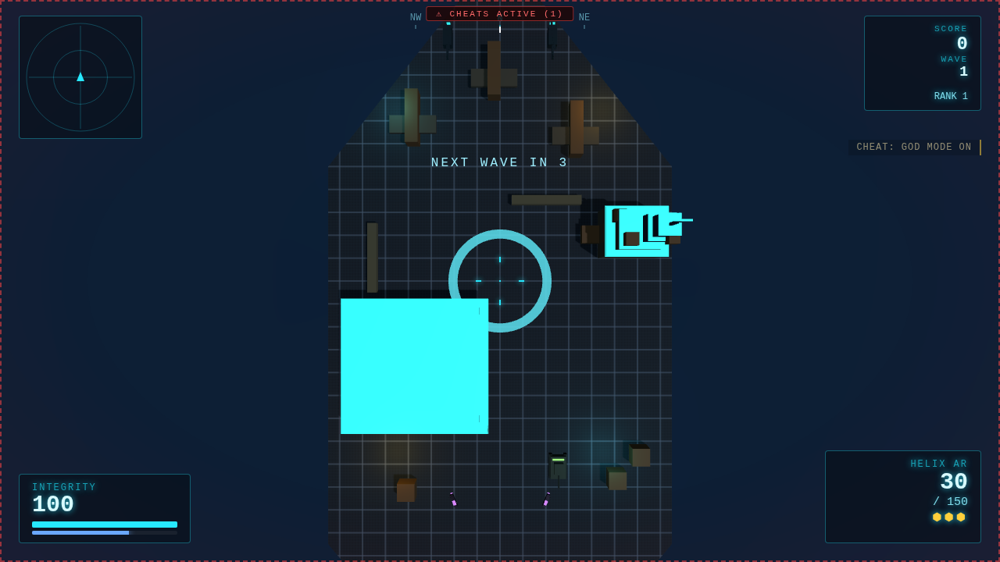

# NEON STRIKE — 3D Web FPS

A wave-survival 3D first-person shooter inspired by Call of Duty, with a
minimalist neon aesthetic, that runs entirely in the browser — solo offline,
or online co-op with rooms. No build step, no external assets — Three.js is
vendored in `lib/`, all textures are generated procedurally, and every sound
effect is synthesized with WebAudio at runtime. UI is available in English
and Traditional Chinese (Taiwan) — 支援繁體中文（台灣）介面.







## Run the full game (server + multiplayer)

```sh
npm install
npm start          # serves the game and the room server on :8080
```

Open <http://localhost:8080>. **SOLO** starts an offline run; **MULTIPLAYER**
opens the room browser — hit **QUICK PLAY** to be matched into the fullest
open lobby (or get a fresh one), or create a room and share the 4-letter
code, ready up, and fight together (8 players per room by default; set
`MAX_PLAYERS` up to 16). Set `PORT` to change the port; the server is a
single Node process (static files + WebSocket room hub) and deploys to any
Node host.

### Production deployment

The server is a single stateless Node process — any Node host works.
With Docker:

```sh
docker build -t neon-strike .
docker run -p 8080:8080 neon-strike
```

Behind a TLS proxy the client automatically uses `wss://`. Serve with
`?nocheats=1` appended to the URL you hand out to disable the dev console.

**Custom server address**: the MULTIPLAYER screen has a server panel — enter
`host:port`, a domain, or a full `ws(s)://`/`http(s)://` URL and hit CONNECT
(status badge shows connecting/connected/failed/offline; the last-used
address persists locally). This lets a statically-hosted frontend talk to a
room server anywhere. Server-side environment variables: `PORT`, `HOST`
(default `0.0.0.0`), `ALLOW_ORIGIN` (CORS, default `*`), `MAX_PLAYERS`
(room capacity, default 8, max 16), and `DEFAULT_SERVER_ADDRESS` — injected
into the page as the default the client offers first-time visitors.

## Solo without Node

The frontend is fully static — any HTTP server works for single-player
(multiplayer needs the Node server):

```sh
python3 -m http.server 8080
```

## Controls

| Input | Action |
| --- | --- |
| `W A S D` | Move |
| Mouse | Aim |
| Left click | Fire |
| Right click (hold) | Aim down sights |
| `G` | Throw frag grenade |
| `Shift` | Sprint |
| `C` (toggle) / `Ctrl` (hold) | Crouch |
| `Space` | Jump (crates are climbable) |
| `1`–`8` or wheel | Switch weapon |
| `R` | Reload |
| `V` | Quick melee |
| `F` | Plant the charge (Search & Destroy) |
| `0` | Orbital railgun tactical view (once earned) |
| `Esc` | Pause (sensitivity, volume & graphics quality settings) |
| `~` / `F1` | Dev console (cheats) |

## Modes, maps & loadout

Clicking **SOLO** opens mission setup:

- **Modes (10)** — **Survival** (endless robot waves, also the co-op
  mode), **Squad Strike** (30 eliminations vs respawning AI soldiers),
  **Domination** (bot teams contest three zones), **Team Deathmatch**
  (your fireteam vs an enemy squad, first to 30), **Versus**
  (free-for-all, online PvP or offline vs bots), **Capture the Flag**
  (steal their banner, 3 caps; dead carriers drop it), **Hardpoint**
  (hold a zone that relocates every 40 s, first to 120), **Gun Game**
  (every kill advances you through a 12-weapon ladder), **Search &
  Destroy** (plant at A or B with `F`, one life per round while the
  charge is down, first to 3 rounds), and **Infection** (survive
  PATIENT-0 for 3 minutes — anyone killed turns, including you). The
  full AI algorithm is documented in [docs/AI.md](docs/AI.md).
- **Maps (10, with a screenshot picker)** — the compact **Neon Arena**, the large dusk **Sector K
  Battlefield** (bunkers, sandbag lines, watchtowers, a central hill),
  the low-gravity **Helios Station**, the naval **CVN Tempest Carrier**,
  the open **Amber Wastes** desert (dune plateaus, rock spires, ancient
  ruins), and the two-layer **Apex Rooftop** — a skyscraper summit at
  night with a walkable penthouse roof deck over glass-walled rooms,
  antenna masts, a helipad, crate stairs between layers, and a
  surrounding city of **real low-poly tower models** with lit windows
  rising out of the cloud sea. Two more arenas round out the rotation:
  **Frostline Base**, an open tundra listening post in a blizzard —
  visibility drops to ~20 m, sniper towers pierce the fog, and leaving
  the area of operations starts the out-of-bounds countdown — and
  **Rustworks Factory**, an enclosed industrial yard with two pillared
  production halls whose roofs are walkable catwalks, machinery cover,
  conveyor lines, smoke stacks, and a container maze. Every outdoor map
  wraps a procedural 360° panoramic skybox — starfield, Earth and nebulae over the
  station, ocean, cumulus and sun around the carrier, hazy noon sky
  over the desert, a burning dusk over the battlefield, and a starry
  night above the rooftop — painted onto canvas at load, no texture
  downloads. The **Undercity Tunnels** — a fully enclosed corridor grid
  under a ceiling, 10 m visibility, knife-fight CQB — and the **Ashfall
  Ruins**, a post-war district of gutted, enterable building shells
  with walkable upper floors, complete the set. All maps support every
  mode, mission setup shows all ten as in-game screenshot cards, and
  the co-op host picks the map in the lobby.
- **Open edges** — not every map is walled. The carrier deck and the
  rooftop have real edges: step off and you fall to your death (the
  ocean, or the streets far below). The desert has no walls at all —
  leaving the mission area starts a 5-second return countdown before
  you're gone. The carrier is a true **warship-shaped hull** — long
  deck, tapered bow, chamfered stern — with a multi-level bridge
  tower to climb: observation decks, a radar mast, and sniping
  positions over the flight deck. AI never wanders off the hull.
- **Equipment (pick 2)** — **Armor Plates** (blue armor pool absorbs
  damage, refilled by ammo cells and resupply drops), **Combat Helmet**
  (-40% explosive / -25% gunfire damage), **Stim Injector** (faster
  regen), **Raider Boots** (+8% speed, higher jump).
- **Vehicles** — press `E` next to any vehicle to board, `E` again to exit.
  **Hoverbikes**: W/S throttle, A/D steer, ram enemies at speed.
  **Battle tank** (600 hull): slow and enclosed — incoming damage hits the
  hull, the turret tracks your camera, click lobs splash shells, and the
  tracks crush anything you drive over. **Gunship helicopter** (350
  hull): a big airframe with stub wings and rocket pods, flown from a
  **belly-gunner camera slung below the aircraft** — W/S pitch, A/D
  turn, SPACE/CTRL altitude, LMB fires the chin gun through your
  crosshair, RMB launches a rocket volley. Every vehicle has its own
  health pool, can be destroyed (ejecting the rider), and respawns on
  its pad; positions and destruction replicate in multiplayer.
- **Weapon attachments** — five slots (optic, barrel, magazine, grip,
  muzzle), each with two options plus none, picked before deploying and
  saved locally. Every choice is a real stat trade-off applied across the
  arsenal: e.g. the 3× scope tightens ADS zoom but slows you, the extended
  mag holds 40% more at slower reloads, the compensator shrinks spread,
  the vertical grip tames recoil.

## Killstreak rewards

| Streak | Reward |
| --- | --- |
| 3 | **UAV** — full radar for 20 s |
| 5 | Resupply drop (ammo, grenade, armor plates) |
| 6 | **Airstrike** — a stick of five bombs walks a line across your aim point |
| 7 | **Orbital railgun** — press `0` for a top-down tactical view, steer the reticle with the mouse and click to call 3 railgun lances from orbit with heavy AOE splash. Full spectacle: charge-up hum with a converging glow ring, a slim light-strip beam from orbit, a thunderclap impact with screen shake, and a HUD charge indicator |
| 8 | **Care package** — a crate drops ahead with a random reward |
| 10 | Full ammo refill |
| 12 | **Attack helicopter** escorts you for 30 s |
| 15 / 20 | Big score bonuses |

## Core features

- **Aim down sights** — per-weapon zoom and accuracy, reduced mobility, a
  true scope overlay on the sniper.
- **Regenerating health** — survive a few seconds without damage and your
  integrity recovers, CoD-style. Health packs still drop for emergencies.
- **Sprint with sprint-out** — sprinting raises your weapon; you can't fire
  until you settle.
- **Crouch** — smaller profile, steadier aim, slower movement.
- **Killstreaks** — chain kills without taking damage: RAMPAGE (5),
  ONSLAUGHT (10), UNSTOPPABLE (15) and GODLIKE (20) pay score bonuses and
  ammo refills.
- **Full HUD** — rotating radar with threat types, compass strip, kill feed,
  hitmarkers (kill-confirm variant), directional damage indicators, dynamic
  crosshair that opens with movement and fire, low-health effects.
- **Frag grenades** — cooked physics: they arc, bounce, and detonate with
  falloff splash damage that also hurts you.

## Loadout & arsenal

The **LOADOUT** screen (from the menu or mission setup) is a full
pre-match armory: you carry exactly **one primary, one secondary, and
one throwable** into battle (`1` / `2` / wheel to swap, `G` to throw).
Each weapon row shows its class and unlock rank; the stats panel renders
damage / fire-rate / accuracy / range / mobility bars, live **+/-
deltas while hovering** an alternative, and magazine / reload / reserve
numbers. Attachments and equipment live on the same screen, and three
loadout presets (plus a one-click default) persist locally.

**Primaries (16)** — assault rifles *Helix AR, Ravager-47, Volt Carbine
(burst)*; SMGs *Viper, Hornet-90 (50-rd), Tempo*; shotguns *Breacher
(pump), Mauler-12 (semi-auto)*; LMGs *Bastion, Warhound*; DMRs *Judge,
Falcon-S*; sniper *Spectre* (scope, one-shot potential); the *Havoc RL* rocket
launcher, the *Longbow-50* heavy sniper (rank 9, one-shot potential),
and the *Arc Rifle* energy hyperburst (rank 10).

**Secondaries (4)** — *P-9 Sidearm* (infinite reserve), *Wasp-18*
machine pistol (full-auto), *Ironclad .44* revolver (2.5× headshots),
and the *Stalker-X* crossbow (single bolt, 2.5× headshots).

**Throwables (5)** — *Frag* (cooked splash), *Sticky Bomb* (latches on,
bigger blast), *Flashbang* (whites out and stuns anyone with line of
sight), *Smoke Grenade* (a smoke sphere that blocks AI vision), and the
*Molotov* (shatters on contact into a 6-second burning zone). Quick
melee is always on `V` — a knife jab that works with any weapon out.

Slot `0` calls the **orbital railgun strike** once the 7-killstreak is
earned. Headshots deal double damage (2.5× on the Spectre and Ironclad).

## Progression

Kills and wave clears earn persistent XP (saved locally). Ranks 1–10 unlock
the arsenal — the DMR at rank 2, shotgun at 3, LMG at 4, sniper at 5,
launcher at 6 — and passive perks:

| Rank | Perk | Effect |
| --- | --- | --- |
| 2 | Swift Hands | 20% faster reloads |
| 4 | Conditioning | 8% faster sprint |
| 6 | Bandolier | +1 starting grenade, +2 capacity |
| 8 | Juggernaut | 125 max integrity |
| 10 | Dead Eye | +10% bullet damage |

## Dev console (cheats)

Press `~` or `F1` to open the keyboard-navigable dev console (arrows to
select, Enter to toggle, same key to close). Available cheats: god mode,
infinite ammo, no-reload, instant kill, unlock all weapons, max level,
slow motion, full radar, infinite grenades, plus spawn-next-wave and
reset-all actions.

- Toggles are announced in the kill feed, and a dashed red frame with a
  **CHEATS ACTIVE** badge stays on screen while any cheat is enabled, for
  debugging transparency.
- Cheat states persist between sessions (localStorage).
- Runs played with cheats active do not bank XP or the persistent best score.
- For public builds, serve the game with `?nocheats=1` to disable the
  console entirely.

## Enemies

- **Grunt** (red) — fast melee chaser.
- **Ranger** (blue) — keeps its distance and fires plasma bolts; uses
  line-of-sight, so cover works.
- **Tank** (purple) — slow, huge, and very angry. Appears from wave 4.

Waves grow larger and tougher; every fifth wave is flagged as a danger wave.
Destroyed enemies drop **health packs**, **ammo cells** (a magazine for every
weapon), or **grenade cells**. Score and best streak are tracked with a
persistent local best.

## Multiplayer design

The server (`server/server.js`) manages rooms and relays JSON messages; it
runs no simulation. The room host's browser simulates enemies with the same
code as solo play and broadcasts 10 Hz snapshots; other clients render
interpolated replicas, raycast hits locally, and send damage claims that the
host applies authoritatively. Player states replicate at 15 Hz with name-tag
avatars, kill attribution feeds a shared scoreboard, downed operatives
spectate and redeploy on the next wave, and the match ends when every
operative is down. Cheats are disabled during multiplayer matches. If the
host disconnects mid-match the match ends and the room returns to the lobby.

## Language / 語言 / 语言

The language toggle (top-right of the menus) cycles English → 繁體中文（台灣）
→ 简体中文, persists locally, and auto-detects `zh-*` browsers on first
visit (Traditional for `zh-TW`/`zh-HK`, Simplified otherwise).

## Versus (PvP) & vehicles online

The lobby host can switch the room between **Survival** (co-op vs waves)
and **Versus** — free-for-all PvP, first to 15 kills or best score in 4
minutes, with 3-second respawns. Hoverbikes have their own health pool:
they can be destroyed (ejecting and injuring the rider) and respawn at
their pad after 20 s; in multiplayer, a ridden bike is claimed across
clients.

## AI difficulty & bot players

Mission setup (and the co-op lobby, host-controlled) offers **Easy /
Normal / Hard / Expert** AI difficulty — it drives the soldiers' aim
cone, reaction delay, burst cadence, grenade usage, and speed (and wave
HP/speed in Survival), **and their tactical repertoire**: easy fights in
the open, normal takes cover and flanks occasionally, hard adds
cover-seeking retreats below 35% HP and peek-firing around lost
contacts, and expert runs the full suite — persistent flanking arcs,
suppression fire over last-known positions, and coordinated
advance/overwatch team roles. Flashbangs stun AI and smoke blocks every
AI sight line. Bots also **use vehicles**: from normal difficulty up,
a bot with a distant objective will commandeer a free hoverbike, ride
it into the fight (watch for drive-by rams), and hop off close-in — and
on hard and expert they **crew battle tanks**, holding hull-down at
mid-range while the turret tracks you and the cannon fires with real
line of sight. The full algorithm is documented in
[docs/AI.md](docs/AI.md). **Versus** is now
also playable solo: three bot players with real weapons, armor, regen,
respawns, and scoreboard entries fill the FFA — first to 15 kills.
**Domination** is a true team fight: a 3-bot enemy squad pushes,
captures, and defends zones while an allied bot (COBALT) fights beside
you and captures for your side. The fourth map, **CVN Tempest Carrier**,
is a naval deck with a multi-tier climbable island, parked jets for
cover, a roofed hangar bay, and hoverbike pads.

## Roadmap

The roadmap is fully shipped: 10 modes, 10 maps with a screenshot map
picker, a 20-weapon loadout armory with melee and five throwables,
drivable and AI-crewed vehicles, the full killstreak ladder, bot fill
in online versus rooms, and skill-based quick play. The pause menu's
**graphics quality** setting (LOW / MEDIUM / HIGH) trades resolution
and shadows for frame rate on low-end devices.

## Online: bot fill, matchmaking & parties

- **Bot fill** — the versus lobby has a host-controlled **BOTS**
  counter (0–3). Fill bots are simulated by the host with the full
  tactical AI, replicated to every client at 10 Hz, and can be shot by
  anyone: client hits relay damage claims to the host, and kills count
  on the shared scoreboard toward the 15-kill target.
- **Skill-based quick play** — clients report their rank; QUICK PLAY
  places you in the open lobby whose average rank is closest to yours
  (fullest first on ties), and the room browser shows each lobby's
  average rank (`~R4`).
- **Parties** — a room code *is* your party: create one, share the
  4-letter code, and the lobby persists across matches (scoreboard,
  host map/mode/difficulty/bots controls), so your squad stays together
  from game to game.

## Tech notes

- [Three.js](https://threejs.org/) r170, vendored as a single ES module in
  `lib/three.module.js` (MIT).
- Custom AABB "move and slide" physics for the player and enemies — walk into
  crates to be blocked, jump on top of them for a vantage point.
- Hitscan weapons raycast against enemy hitboxes (separate head hitbox for
  headshots) and world geometry, with pooled tracers and GPU point-sprite
  particles. Rockets and grenades are simulated projectiles with radial
  splash falloff.
- Enemy AI: seek/strafe steering with separation, stuck detection with
  sidestep recovery, and raycast line-of-sight checks for ranged attacks.
- Procedural canvas textures, DOM/CSS HUD with canvas radar + compass,
  WebAudio-synthesized SFX.
- Node + `ws` room server; co-op uses host-authoritative simulation with
  client-side hit claims and interpolated replication.
- i18n via a tiny dictionary module (`src/i18n.js`) with `data-i18n` DOM
  bindings; adding a language means adding one table.

## Development

Plain ES modules — edit and refresh. `window.__game` exposes the game
instance in the console for debugging (e.g. `__game.godMode = true`).
